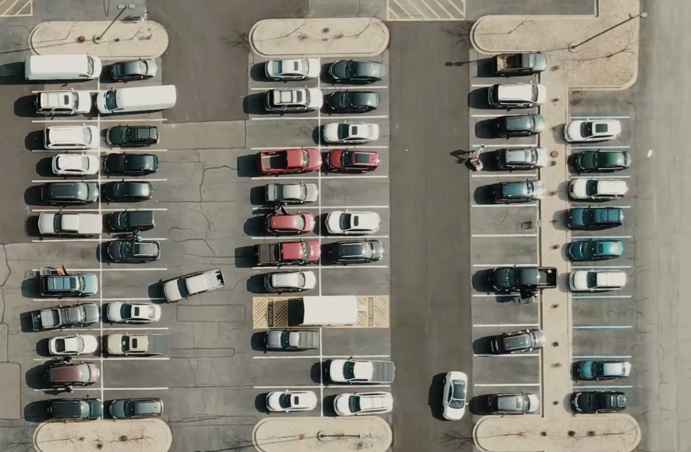

# 🚗 Parking Space Detection using OpenCV

This project detects available parking spaces in a parking lot using OpenCV and a static video feed. It uses image processing techniques to differentiate between occupied and free spots in real-time.

---

## 📁 Project Files

| File | Description |
|------|-------------|
| `main.py` | Runs the detection system on the parking video. |
| `ParkingSpacePicker.py` | Used to manually select parking spots and save positions. |
| `carPark.mp4` | Raw video footage of the parking lot. |
| `CarParkPos` | Pickle file storing positions of selected parking spots. |
| `parkingimg.png` | Image used for manually selecting parking spots (with bounding boxes). |
| `demo image.png` | Screenshot showing live output from the detection system. |
| `Image.png` | Optional placeholder/reference image. |

---

## 🧰 Features

- Detects vacant and occupied parking spaces using computer vision.
- Annotates live video feed with real-time spot availability.
- Manual bounding box selection for flexibility.
- Displays total number of available spots.

---

## 🧠 How It Works

### 1. Mark Parking Areas
Use `ParkingSpacePicker.py` to mark each parking spot manually:
- **Left click** to add a parking space.
- **Right click** to remove a parking space.

### 2. Run Detection
Run `main.py` to start analyzing the parking video:
- Processes each frame using OpenCV (grayscale, blur, thresholding).
- Crops out each parking region.
- Counts non-zero pixels to determine if the spot is free or occupied.
- Updates the live frame with rectangles and count display.

---

## 🖼️ Example Output

### Parking Space Selection (`parkingimg.png`)


### Live Detection Output (`demo image.png`)


---

## 📹 Sample Video

The video used (`carPark.mp4`) is a raw, unedited recording showing vehicles coming and going in a parking lot, ideal for testing the dynamic detection logic.

---

## ▶️ Run the Project

```bash
python ParkingSpacePicker.py  # to define parking spaces
python main.py                # to start the detection system
```

---

## 📊 Requirements

- Python 3.x
- OpenCV
- cvzone
- NumPy

Install dependencies:

```bash
pip install opencv-python cvzone numpy
```

---

## 📌 Notes

- Adjust the `width` and `height` variables to match your parking space size.
- You can use any other parking lot video as long as the camera angle is consistent.

---

